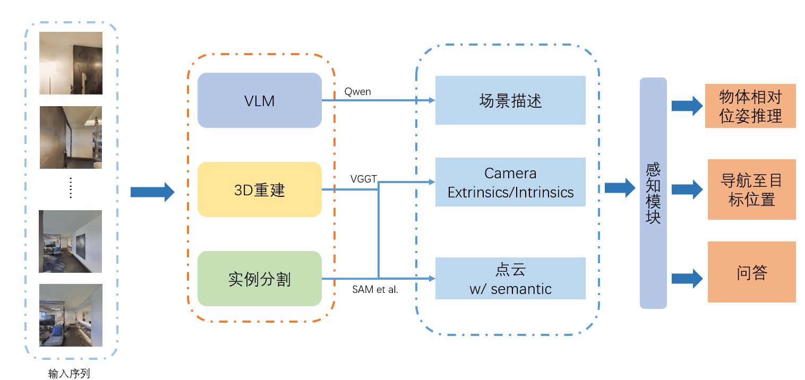
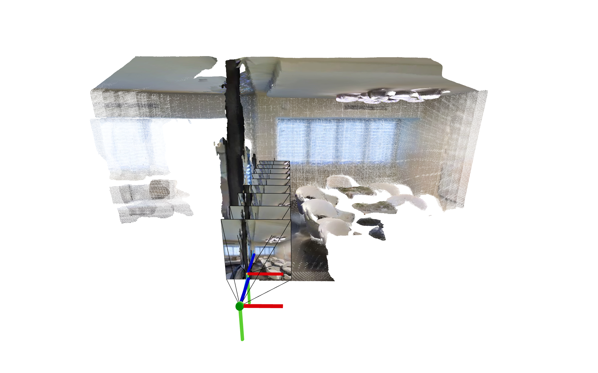
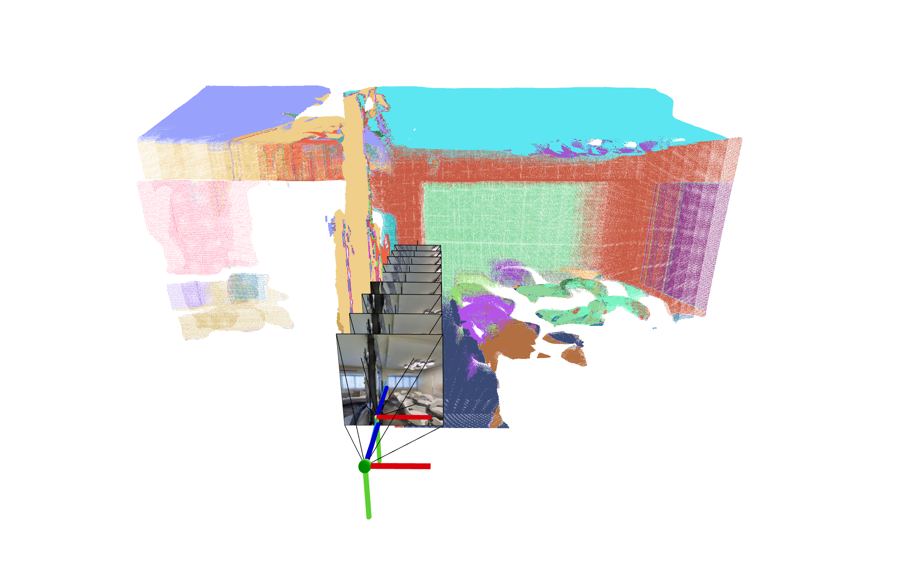

# Simulator-Video-Dataset

## Intro
基于Habitat-Sim及3D资产(ScanNet++， HM3D et al.)及VLM，创建视频数据集，以用于
- 输入单帧图像：
  - 相机/Agent位姿推理
  - 物体检测分割+相对位置推理

- VLM交互
  - Agent引导：如何走到query object的位置
  - 具身问答

## Pipeline

  

### Point Cloud

  <figure style="display:inline-block; width:100%; margin:0 0.5%;">
    
    <figcaption><strong>无语义点云</strong> </figcaption>
  </figure>

  <figure style="display:inline-block; width:100%; margin:0 0.5%;">
    
    <figcaption><strong>带语义的点云</strong></figcaption>
  </figure>

### Scene Description Example

  

### DONE
- [x] 添加Habitat-Sim 场景随机轨迹生成脚本，支持本地存储可视化视频、语义图
- [x] VGGT深度+相机内外参推理，生成点云 w/ semantic；
- [x] Qwen推理脚本，生成结构化描述，支持本地存储；

### TODO
- [ ] 分割头，实时分割场景中的实例物体；
- [ ] VGGT微调及数据预处理(optional)
- [ ] VLN & 感知模块